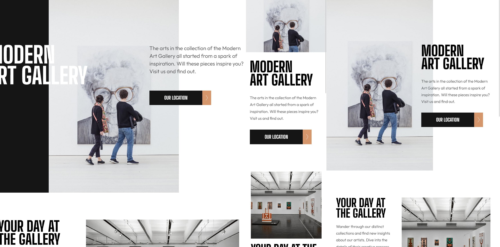

# Frontend Mentor - Art gallery website solution

  

This is a solution to the [Art gallery website challenge on Frontend Mentor](https://www.frontendmentor.io/challenges/art-gallery-website-yVdrZlxyA). Frontend Mentor challenges help you improve your coding skills by building realistic projects.

  

## Table of contents

  

- [Overview](#overview)

- [The challenge](#the-challenge)

- [Screenshot](#screenshot)

- [Links](#links)

- [My process](#my-process)

- [Built with](#built-with)

- [What I learned](#what-i-learned)

- [Continued development](#continued-development)

- [Useful resources](#useful-resources)

- [Author](#author)

  

**Note: Delete this note and update the table of contents based on what sections you keep.**

  

## Overview

  

### The challenge

  

Users should be able to:

  

- View the optimal layout for each page depending on their device's screen size

- See hover states for all interactive elements throughout the site

- **Bonus**: Use [Leaflet JS](https://leafletjs.com/) to create an interactive location map with custom location pin

  

### Screenshot

  



  

### Links

  

- Solution URL: [Solution Repo](https://github.com/brunomoleta/improved-spoon)

- Live Site URL: [Live site](https://brunomoleta.github.io/improved-spoon/)

  

## My process
    Started with the mobile layout, then went on the Tablet display and onwards to the Desktop;
  

### Built with

  

- Semantic HTML5 markup

- CSS Grid

- Mobile-first workflow

- TailwindCSS

  

### What I learned

  

At first, I had difficulty positioning the text within the Desktop width. What finally worked out was the following code:
 

```html

<header
class="lg:w-full lg:grid lg:grid-cols-[1fr,auto,1fr] lg:gap-0"
	>
	<canvas
	class="hidden lg:w-[100%] lg:h-[50rem] lg:block lg:bg-dark-900"
	></canvas>

	<div>
    
	</div>

	<div
	class="lg:grid lg:gap-[16rem] absolute
	lg:grid-cols-[1fr,1fr] lg:left-[0] lg:right-0 lg:top-[11.5rem] ">

		<h1  class="lg:justify-self-end">MODERN <br/> ART GALLERY</h1>
		<div  class="lg:justify-self-start">
			<p>The arts in the collection...</p>
			<button></button>
		</div>
	</div>
</header>

```

First, I divided the ```<header>``` into three grid columns where only the
image had an ```auto``` column size (```lg:grid-cols-[1fr,auto,1fr]```). Next, the ```div``` with the text has a ``` position: absolute```.

To position it center I put a ```grid ``` on the parent ```div``` and the left element, ```h1``` is justified on the right
and the right element, on the left.
So it was only a matter of getting the ```gap``` the size of the centered top image.
It feels simple now, but it took me a while to figure that out.

### Continued development

Improve on TailwindCSS and resolving CSS Grid issues faster as by now it's now a natural task for me.  

### Useful resources

- [Tailwind Documentation](https://tailwindcss.com/) - This helped get started, as this was my first project using
Tailwind.

- [Jad Joubran's HTML/CSS Course](https://learnhtmlcss.online/) - Hands down begginer friendly and rich in its content.

## Author

- Frontend Mentor - [@brunomoleta](https://www.frontendmentor.io/profile/brunomoleta)
